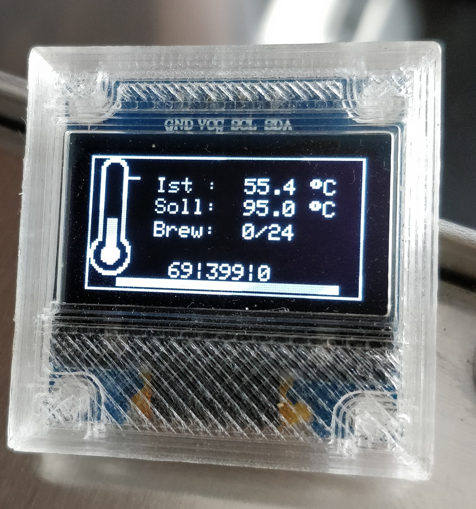

In dieser „Schatzkiste“ stellen wir euch eine lose Sammlung von tollen Umsetzungen rund um das Rancilio Projekt vor – vielleicht hilft euch deiner eine oder andere (virtuelle) Juwel bei euerer Umsetzung? Falls Ihr auch hier euren Link/Umsetzung sehen möchtet, könnt Ihr uns direkt im Chat ansprechen. Ein Bild und ein kurzer Text wäre hierfür sehr hilfreich.

# Ulli’s Smartcoffee Projekt

Unser Entwickler Ulli hat neben dem Rancilio PID Projekt ein eigenes PID Projekt für seine Silvia E aufgebaut. Er hatte das erste All in One Board entwickelt und produziert. Schaut gerne bei Ihm in sein Projekt vorbei:

[SmartCoffee/hardware](https://github.com/Ulli2k/SmartCoffee/tree/master/hardware)

So sieht sein entworfenes PCB aus. Hierbei kommt ein ESP32 statt ESP8266 zum Einsatz.

# Cron1c’s Display Ausgabe

Cron1c’s hat eine eigene Disyplayausgabe erstellt. Diese wurde in der Zwischenzeit in das Projekt intregriert. 

Link zum Code: [ranciliopid-display](https://github.com/cron1c/ranciliopid-display)